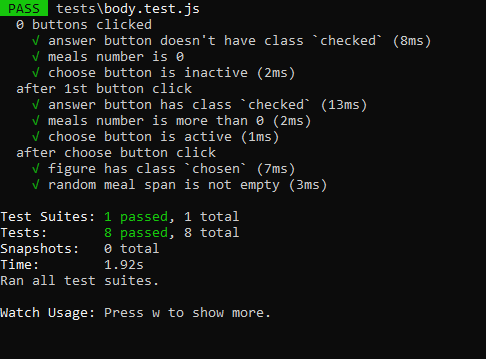

Hello!\
I made first step into writing maintainable code. I wrote first tests! I 
thought it will be hard to test React components and states, because they 
work asynchronously. But it was definitely not. I used delivered with "Create 
React App" [Jest](https://jestjs.io/) and I combined it with 
[Enzyme library](https://enzymejs.github.io/enzyme/). I was surprised, there is 
[airbnb.io](http://airbnb.io/) website and it doesn't help you book homes :D. 
But it allows you to do other very interesting things. Moving to my testing 
adventure.

What can I say about testing React app is that it's very similar to testing 
pure JavaScript things. I've had experience with that before so I knew a bit 
how testing works. Previously I used [Jasmine](https://jasmine.github.io/) (no, 
I didn't use any girl to tests, this just testing framework's name ;D ).
- To start testing I added few devDependencies to package.json file in my 
project and installed it with npm:

```jsx
"devDependencies": {
  "ajv": "^6.4.0",
  "babel-jest": "^22.4.3",
  "babel-preset-env": "^1.6.1",
  "babel-preset-react": "^6.24.1",
  "jest": "^22.4.3",
  "enzyme-adapter-react-16": "^1.1.1",
  "enzyme": "^3.3.0",
  "sinon": "^5.0.3"
}
```

- After that I created first test file ended with "test.js" what allowed test 
runner to find and run my test. As I said before testing JS project was similar 
to testing React project. It's because in Jasmine and in Jest "describe" and 
"it" methods are used. In my opinion it's intuitive and cool.

```jsx
describe('0 buttons clicked', () => {
  it('answer button doesn\'t have class `checked`', () => {
    expect(body.find('button').at(1).hasClass('checked')).toBeFalsy();
  });
});
```

- And this is how it looks in cmd. (Imo readable and cool)



You can find of course all my code and check how those tests work by visiting 
my [GitHub](https://github.com/JakubKus). That's all for now, thanks for 
reading.

Have a good day/night! ;D
